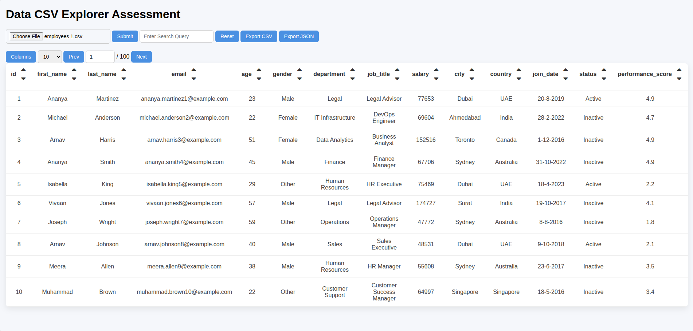
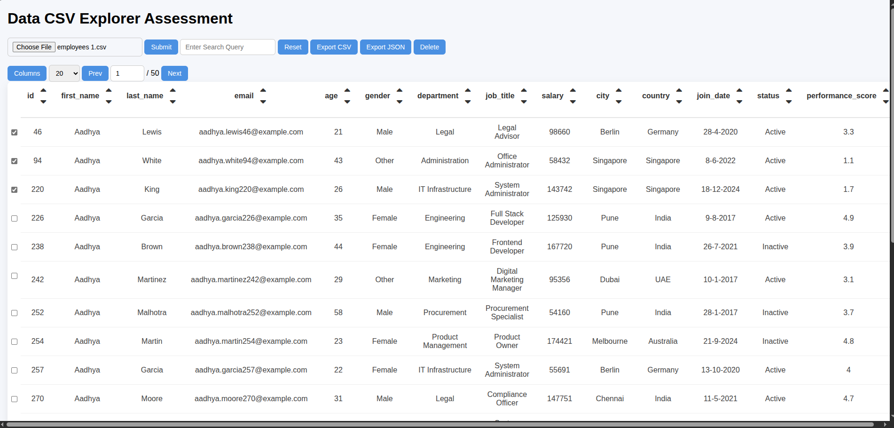
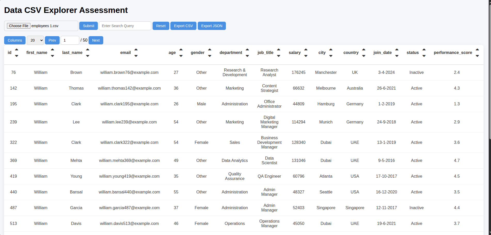
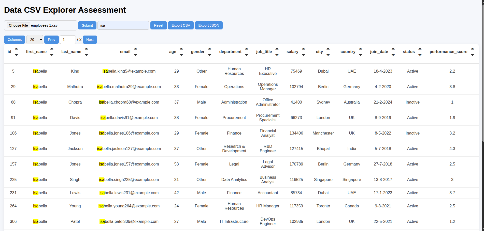
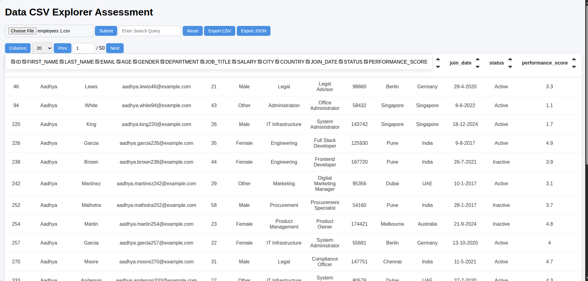
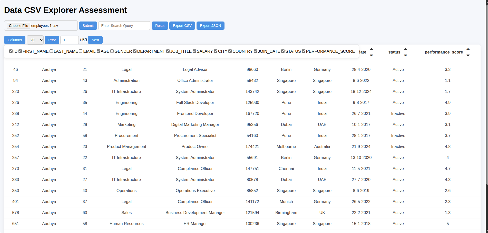
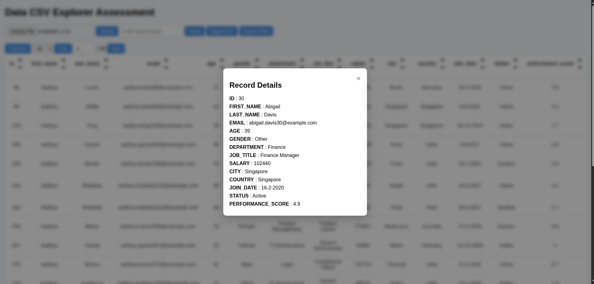

# 📊 CSV Data Explorer

A lightweight, fully client‑side **JavaScript CSV Viewer & Data Explorer** that loads large CSV files (1000+ rows), converts them to JSON, and provides an interactive UI for filtering, sorting, pagination, exporting, and more.

This project is built strictly with **Vanilla JavaScript (ES6+), HTML, and CSS** — no external libraries or frameworks — in accordance with the assignment requirements.

---

## 🚀 Features Overview

### 🔍 Core Requirements (from assignment.md)

- **CSV Parsing**
    - Reads CSV via file upload
    - Converts to JSON (array of objects)
    - Handles headers, empty fields, and mixed data types

- **Dynamic Data Table**
    - Generates table headers from CSV
    - Renders large datasets efficiently
    - Loading indicator during parsing

- **Pagination**
    - Page size options: **10 / 20 / 50 / 100**
    - Next / Previous + direct page navigation
    - Works seamlessly with filtering & sorting

- **Sorting**
    - Click any column header to sort
    - Ascending / Descending toggle
    - Numeric & string sorting
    - Visual indicator (↑ / ↓)

- **Global Filtering**
    - Search across all columns
    - Case-insensitive, partial match
    - Debounced input
    - Compatible with pagination & sorting

---

## 🧩 Additional Features (≥4 as required)

This project includes **7 additional enhancements**:

1. Column visibility selector
2. Row deletion (single + bulk)
3. Row detail modal panel
4. Export filtered/visible data (CSV/JSON)
5. Highlight matched search text
6. Reset filters & sorting

---

## 📁 Folder Structure

```
├── index.html
├── script.js
├── style.css
├── readme.md
└── src/
        ├── csvParser.js
        ├── DataTable.js
        ├── debounce.js
        ├── exportData.js
        ├── filterData.js
        ├── modalPanel.js
        ├── sortData.js
        └── tableRender.js
```

---

## 🗂️ Module Responsibilities

### csvParser.js

Parses CSV text into an array of objects.
Handles:

- header detection
- trimming
- empty values
- numeric/string conversion

### DataTable.js

Central state manager:

- raw data
- filtered data
- visible columns
- pagination state
- selected rows

### debounce.js

Utility for debounced search input.

### exportData.js

Exports current dataset (including filters & visible columns) as:

- .csv
- .json

### filterData.js

Implements global search:

- case‑insensitive
- partial match
- text highlighting

### sortData.js

Handles column sorting:

- asc / desc toggling
- numeric/string differentiation

### modalPanel.js

UI for displaying full row details.

### tableRender.js

Responsible for:

- table rendering
- pagination controls
- sorting indicators
- column visibility UI

---

## 🧪 How to Use

Follow the steps below to run the project locally and use the web UI.

### 1. Clone & open

```bash
git clone https://github.com/ronaksharma-simform/CSV_Data_Explorer
cd CSV_Data_Explorer
```

Open index.html in your browser (or use Live Server in VS Code).

### 2. Open the website

- If using Live Server, open the provided URL (e.g., http://127.0.0.1:5500).
- Or open index.html directly in your browser.

### 3. Load a CSV file

- Click the "Choose File" / "Upload CSV" button or drag-and-drop a .csv file onto the upload area.
- Supported: standard CSV files with a header row. The app will parse and show a loading indicator for large files.

### 4. Common operations you can perform

- View table: Data renders as a table with headers generated from the CSV.
- Sort: Click any column header to toggle ascending/descending. Numeric and string columns are detected automatically.
- Filter (global search): Use the search box to perform a case-insensitive, partial match across all columns. Input is debounced.
- Pagination: Change page size (10 / 20 / 50 / 100), navigate pages, or jump directly to a page.
- Column visibility: Use the column selector to hide/show columns without modifying the data.
- Row selection & deletion: Select rows (single or multiple) and delete them (bulk delete or single row delete).
- Row details: Click the "View" or row details action to open a modal with full row data.
- Export: Export the currently visible & filtered data as CSV or JSON (exports respect visible columns and filters).
- Highlighting: Matched search terms are highlighted in the table.
- Reset: Click "Reset" to clear filters, sorting, selections, and return to the initial dataset.

### 5. Tips

- Large files: parsing is client-side; use the loading indicator and wait for completion.
- Preserve original CSV: use Export to save filtered/modified views without changing your source file.
- Troubleshooting: ensure the CSV has a consistent header row and comma separators; for unusual formats, preview the file in a text editor.

---

## 🛠️ Technical Constraints

✔ Vanilla JavaScript (ES6+)  
✔ No frameworks  
✔ No external CSV parsing libraries  
✔ Client-side only  
✔ Modular code structure

---

## 📸 Screenshots

(Replace images with your own)

### Table View with pagination, sorting, and filtering controls



### Filtering & Sorting in action




### Filtering with highlighted search text



### Row Selection & Bulk Deletion


### Column Visibility Selector



### Only Selected Column View



### Row Detail Modal Panel



## Contributing

Contributions are welcome! You can:

- Fork the repository

- Create a new branch (git checkout -b feature/your-feature)
- Commit your changes (git commit -m "Add feature")

- Push to the branch (git push origin feature/your-feature)

- Open a Pull Request

## License

This project is for assessment purposes. Modify and use as needed.
